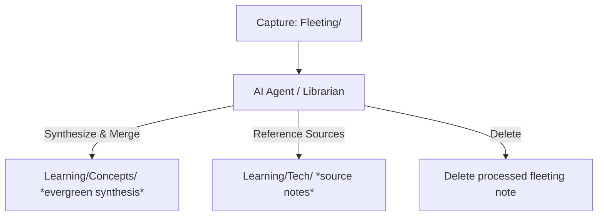

The **LLM Wiki** is a stateful knowledge-management concept where an AI agent acts as an automated "librarian" to continuously build, organize, and maintain a persistent, interlinked wiki from raw notes. 

This stands in contrast to typical stateless RAG (Retrieval-Augmented Generation) systems, which process user queries on demand without long-term updates or structural synthesis of the underlying vault.

## Core Philosophy
The concept was originally proposed by Andrej Karpathy (see [Karpathy's LLM Wiki Gist](https://gist.github.com/karpathy/442a6bf555914893e9891c11519de94f)), outlining these principles:
1. **Stateless RAG is insufficient:** Simple retrieval of chunked text lacks a coherent, synthesized overview of a topic.
2. **Stateful Consolidation is needed:** An agent should proactively synthesize and deduplicate incoming information, editing and appending to centralized "evergreen" articles.
3. **Internal Backlinking:** Concept pages must be heavily interlinked to construct a dense, navigable knowledge graph.

---

## Vault Implementation
In the `WisdomWell` vault, the LLM Wiki is operationalized natively without external plugins, using a custom agent pipeline:



### 1. The Ingestion Pipeline
- **Raw Captures:** Fleet notes, ideas, audio transcripts, or web articles are dumped into the `Fleeting/` directory.
- **Triggering the Librarian:** The agent executes the custom `wiki-librarian` skill (configured in `.agents/skills/wiki-librarian/SKILL.md`).
- **Concept Extraction & De-duplication:** For each fleeting note, the librarian identifies the main concepts:
  - If a concept page already exists in `Learning/Concepts/`, the agent appends or merges the new details into it.
  - If it is a new concept, the agent creates a new atomic note in `Learning/Concepts/`.
- **Source Referencing:** Original materials (such as processed web articles or video summaries) are saved in `Learning/Tech/`, and the concept notes link back to them as sources.
- **Automatic Cleanup:** Once a fleeting note is fully synthesized, it is deleted to maintain a clean workspace.

### 2. Note Structure & Conventions
Every synthesized concept note in the LLM Wiki follows these conventions:
- **Location:** Saved in `Learning/Concepts/`.
- **Frontmatter:** Contains standard fields and a `synthesis` tag:
  ```yaml
  tags: [synthesis, topic-tag]
  created: YYYY-MM-DD HH:mm
  updated: YYYY-MM-DD HH:mm
  ```
- **Wikilinks:** Proactively linked using `wikilinks` to relate concepts, technologies, events, or books.

---

## Related Notes
- Obsidian AI Tips
- Home Dashboard
- LLM Wiki Project
- [[PARA Method]]
