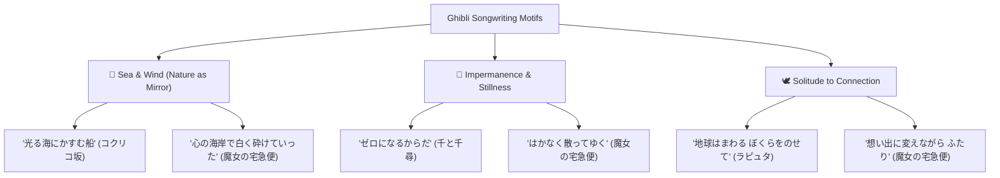

# 🎵 Japanese Song Study Hub

A curated repository of Japanese songs analyzed for language acquisition, poetic nuance, grammar structures, and cultural depth.

Songs provide an authentic bridge between textbook grammar (such as the IRODORI curriculum) and expressive, emotional native Japanese—featuring metaphorical language, compound verbs, omitted subjects, and classical aesthetic concepts.

---

## 🎼 Repertoire Overview

| Title                                                                                | Film / Origin                                     | Vocalist                 | Lyricist / Composer     | Key Grammar & Themes                                                                             |
| :----------------------------------------------------------------------------------- | :------------------------------------------------ | :----------------------- | :---------------------- | :----------------------------------------------------------------------------------------------- |
| [[Learning/Japanese/Songs/Itsumo Nando Demo\|いつも何度でも]] _(Always With Me)_  | 千と千尋の神隠し _(Spirited Away, 2001)_       | 木村弓 (Youmi Kimura)    | 覚和歌子 / 木村弓       | `〜きれない`, `〜尽くす`, `そのたび` • Impermanence, returning to zero, inner light           |
| [[Learning/Japanese/Songs/Kimi wo Nosete\|君をのせて]] _(Carrying You)_           | 天空の城ラピュタ _(Castle in the Sky, 1986)_   | 井上あずみ (Azumi Inoue) | 宮崎駿 / 久石譲         | `〜のは〜から`, `乗せる`, `〜込む` • Heritage, departure, cosmic connection                   |
| [[Learning/Japanese/Songs/Sayonara no Natsu\|さよならの夏]] _(Summer of Goodbye)_ | コクリコ坂から _(From Up on Poppy Hill, 2011)_ | 手嶌葵 (Aoi Teshima)     | 万里村ゆき子 / 坂田晃一 | `〜かしら`, `〜ば` vs `〜たら`, `〜交う` • Showa nostalgia, maritime imagery, eternal refrain |
| [[Learning/Japanese/Songs/Meguru Kisetsu\|めぐる季節]] _(Changing Seasons)_       | 魔女の宅急便 _(Kiki's Delivery Service, 1989)_ | 井上あずみ (Azumi Inoue) | 吉元由美 / 久石譲       | `〜すぎる`, `〜だって`, `〜だす`, `〜ゆく` • Four seasons of adolescence, finding purpose     |

---

## 🔍 Cross-Song Grammar & Poetic Structures

Analyzing lyrics across multiple songs reveals patterns rarely taught in basic textbooks:

### 1. The Poetic Attribution: `〜のは〜から(だ)`

Nominalizing a phenomenon with `のは` to reveal its emotional origin through `から`:

- **[[Learning/Japanese/Songs/Kimi wo Nosete\|君をのせて]]:**
  > あの<ruby>地平線<rt>ちへいせん</rt></ruby> <ruby>輝<rt>かがや</rt></ruby>く**のは**　どこかに<ruby>君<rt>きみ</rt></ruby>をかくしている**から**  
  > _The reason the horizon glows is because it is hiding you._
- **[[Learning/Japanese/Songs/Kimi wo Nosete\|君をのせて]]:**
  > たくさんの<ruby>灯<rt>ひ</rt></ruby>がなつかしい**のは**　あのどれかひとつに <ruby>君<rt>きみ</rt></ruby>がいる**から**  
  > _The reason all those lights feel nostalgic is because you are beneath one of them._

### 2. Introspective Questioning: `〜かしら` (_kashira_)

A gentle, feminine sentence ending that softens questions into reflective wonder:

- **[[Learning/Japanese/Songs/Sayonara no Natsu\|さよならの夏]]:**
  > <ruby>夏色<rt>なついろ</rt></ruby>の<ruby>風<rt>かぜ</rt></ruby>に あえる**かしら** (_I wonder if I will meet the summer-colored breeze_)  
  > あなたはわたしを <ruby>探<rt>さが</rt></ruby>す**かしら** (_I wonder if you might be searching for me_)  
  > あなたはわたしを <ruby>抱<rt>だ</rt></ruby>く**かしら** (_I wonder if you will hold me in your arms_)

### 3. Exhaustion & Limit Particles: `〜きれない` & `〜尽くす`

Expressing the impossibility or completion of emotional expressions:

- **[[Learning/Japanese/Songs/Itsumo Nando Demo\|いつも何度でも]]:**
  > かなしみは <ruby>数<rt>かぞ</rt></ruby>え**きれない**けれど (_Sorrows are countless / cannot be fully counted_)  
  > かなしみの<ruby>数<rt>かず</rt></ruby>を <ruby>言<rt>い</rt></ruby>い\**尽<rt>つ</rt></ruby>くすより (*Rather than exhausting words listing all sorrows\*)

### 4. Continuity & Journey Markers: `〜てゆく` / `〜ていく`

Signifying movement onward through time and space into the open future:

- **[[Learning/Japanese/Songs/Itsumo Nando Demo\|いつも何度でも]]:** ゼロになるからだ <ruby>充<rt>み</rt></ruby>たされて**ゆけ**
- **[[Learning/Japanese/Songs/Sayonara no Natsu\|さよならの夏]]:** ゆるい<ruby>坂<rt>さか</rt></ruby>を おりて**ゆけば** / <ruby>空<rt>そら</rt></ruby>の<ruby>海<rt>うみ</rt></ruby>を**ゆくの**
- **[[Learning/Japanese/Songs/Meguru Kisetsu\|めぐる季節]]:** はかなく<ruby>散<rt>ち</rt></ruby>って**ゆく** / とけて**ゆく**<ruby>粉雪<rt>こなゆき</rt></ruby> / <ruby>夢<rt>ゆめ</rt></ruby>を<ruby>渡<rt>わた</rt></ruby>って**ゆこう**

---

## 🌊 Recurring Studio Ghibli Thematic Motifs

1. **The Ocean as Distance and Destiny:**
   - In _Sayonara no Natsu_, the sea is the expanse where the father's ship disappeared and where memory lingers.
   - In _Meguru Kisetsu_, the ocean at Koriko represents external calm masking internal upheaval.
   - In _Itsumo Nando Demo_, the singer stops searching across the distant sea (`海の彼方には もう探さない`), finding wholeness within.
2. **"Returning to Zero" (_ゼロになる_):**
   - Stripping away superficial layers, anxiety, and burdens to return to a pure, clear foundation before stepping forward into the morning.
3. **The Window as Threshold (`窓辺`):**
   - Kiki rests her chin at the windowsill in uncertainty, then steps forth from that exact window.
   - Chihiro greets the quiet window of a new beginning (`はじまりの朝の静かな窓`).

---

## 📚 Study Workflow for New Songs

When adding new song studies to this collection:

1. **Furigana Requirement:** Always annotate all kanji with standard HTML <code>&lt;ruby&gt;漢字&lt;rt&gt;かんじ&lt;/rt&gt;&lt;/ruby&gt;</code> tags.
2. **Dual-Column Lyrics Table:** Maintain two columns: `Japanese` (with furigana and line breaks ` `) and `English` (poetic translation).
3. **🔑 Contextual Vocab & Points:** Place immediate breakdowns after each stanza.
4. **💭 Deep Nuance Section:** Highlight cultural background, philosophical motifs, and director/lyricist context.
5. **🗂️ Vocabulary Review Card:** Summary table of high-yield words for spaced repetition and Anki sync.

---

## 🔗 Related Vault Hubs

- Japanese Learning & Anki Playbook
- Japanese Vocabulary Master List
- IRODORI A1 Curriculum
- IRODORI A2-1 Curriculum
- IRODORI A2-2 Curriculum
