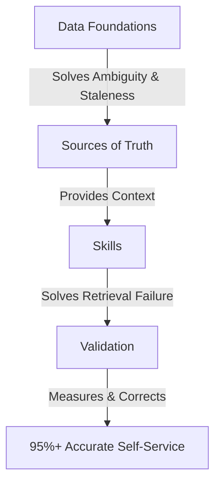

# How Anthropic Enables Self-Service Data Analytics with Claude

**URL:** https://claude.com/blog/how-anthropic-enables-self-service-data-analytics-with-claude

## Summary

At Anthropic, 95% of business analytics queries are automated via Claude, achieving ~95% accuracy. Self-service data analytics is primarily a **context and verification problem** (mapping questions to the right entities), not a code-generation problem. This article details the three core failure modes of analytics agents—concept/entity ambiguity, data staleness, and retrieval failure—and outlines the agentic analytics stack, custom skills system, and validation techniques Anthropic uses to solve them.

---

## Details

### 1. Data Analytics vs. Software Engineering

- **Open-Ended vs. Deterministic:** Coding allows creative solutions and has deterministic feedback loops (compilers, tests, execution logs). Analytics is highly constrained: there is usually only a single correct source and answer, with no easy way to prove correctness automatically.
- **The Core Bottleneck:** The primary challenge is mapping user concepts (e.g., "active users") to specific, up-to-date warehouse entities and knowing how to aggregate them. If that mapping is accurate, the resulting SQL is trivial.

### 2. Three Failure Modes

1. **Concept <> Entity Ambiguity:** Hundreds of fields exist; the agent struggles to identify the exact definitions (e.g., what counts as an "active" user, which exclusions apply).
2. **Data Staleness:** Schema changes, business definitions shift, and agent context rot over time.
3. **Retrieval Failure:** The right data exists but the agent fails to find it in a massive search space.

### 3. Anthropic's Agentic Analytics Stack

#### A. Data Foundations (Governance & Clean Modeling)

- **Canonical Datasets:** Curating a small set of single-source-of-truth logical models and aggressively deprecating duplicates.
- **Tooling & CI Enforcements:** Downstream models must build on canonical layers; changes that bypass standard datasets fail CI reviews.
- **Artifact Colocation:** Code, semantic layers, reference docs, and skill markdown are stored in a single repository. If a data model changes, the documentation and skill file must be updated in the same pull request (PR).
- **Legible Metadata:** Treating table/column descriptions, lineage, and tiering with the same engineering rigor as code.

#### B. Sources of Truth (Context Surfaces)

- **Semantic Layer:** Metric and dimension definitions compiled directly. The agent is structurally required to try the semantic layer first. Anthropic recommends **generating documentation with Claude but having humans own the metric definitions** (bootstrapping metric definitions with LLMs produced inaccurate results).
- **Lineage & Graphs:** Helps agents trace dependencies and query upstream models if a direct metric does not exist.
- **Business Context:** Pipe in a company knowledge graph (indexed roadmaps, decision logs, organizational structures) so Claude understands business-specific terms, active launches, and intent.
- **Query Corpus:** Raw retrieval of past SQL queries moved accuracy by less than a point (unstructured retrieval doesn't scale). Instead, query history should be distilled by humans into structured reference docs.

#### C. Custom Skills (Procedural Knowledge)

Without skills, Claude's accuracy on analytics tasks was only 21%. Adding skills boosted it to **95%+** (and 99% in specific domains).

- **Pairwise Skills:**
  - **Knowledge Skill:** A thin top-level router that identifies the question's domain and loads the specific reference file (reducing the search space to a few dozen files).
  - **Playbook / Unbook Skill:** Encodes step-by-step logic senior analysts follow (clarifying questions, querying, and sending the results to adversarial review sub-agents).
- **Skill Maintenance:** Colocating skill markdown in the data repo. A CI check flags data model PRs that do not update the corresponding skill file.
- **Seamless Syncing:** Syncing skill files via MCP (Model Context Protocol), Cloud storage, and IDE plugins to ensure consistent behavior across Slack, CLI, and dashboards.

#### D. Validation & Evaluations

- **Offline Evals:** Question/answer pairs anchored to stable snapshots to prevent drift. Results are stored as telemetry (metrics over time).
- **Ablation Studies:** Systematically removing features (like sub-agents or raw query search) to measure impact. For instance, granting direct search over raw query history showed net-zero improvement, proving entity-mapping was the bottleneck.
- **Online Validation:**
  - **Adversarial Review:** Running a dedicated sub-agent to challenge the generated SQL and findings (boosted accuracy by 6% but increased latency by 72%).
  - **Provenance Footer:** Every output displays its source tier (semantic layer, curated reference, or raw table), data freshness, and ownership to build user trust.
  - **Active Correction Harvesting:** A scheduled agent scans channels for user corrections (e.g., "you used the wrong table"), drafts a fix for the markdown reference doc, and opens a PR.

---

## My Takeaways

1. **Skills > Raw Model Intelligence:** Just as Anthropic saw a jump from 21% to 95% accuracy by introducing procedural Markdown instructions (skills), structuring clear guidelines in `AGENTS.md` and our specialized `.agents/skills/` is the single most effective way to keep local agents aligned and accurate.
2. **Retrieval Overload is Real:** Giving an agent access to every file or raw history (unstructured search) leads to retrieval failure. Curating high-quality indexes, reference structures, and clear routing paths (e.g., PARA, distinct folder schemas) is much more robust than letting agents grep everything.
3. **Preventing Knowledge Rot via Colocation:** Documentation rots unless it is colocated with the implementation. By keeping scripts, configurations, and notes close together in the vault (`WisdomWell` / `nerdy9a.dev`), we can prevent agent instructions from falling out of sync with our current setup.
4. **Adversarial SQL & Code Reviews:** Running validation scripts or double-checking outputs using subagents (e.g., checking translations or build outputs before committing) is a pattern we should adopt for complex automation scripts (like the sync/publish python scripts).

---

## Related Notes

- [[How Claude Code Works in Large Codebases]] — Explores the extension harness, MCP, and skill system of Claude Code.
- [[AI Engineering Principles from the Head of Claude Code]] — Shares operating principles for agentic orchestrations from Boris Cherny.
- Obsidian AI Tips — Techniques for managing token efficiency and prompt structures.
