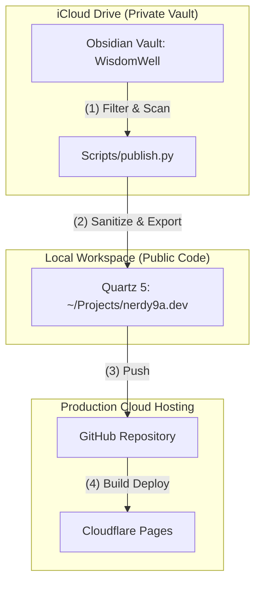

# How this Digital Garden is Built

This digital garden (**[nerdy9a.dev](https://nerdy9a.dev)**) is designed to publish public notes from a private Obsidian vault without leaking personal data or breaking link integrity.

## 📓 What is Obsidian?
If you aren't familiar with [Obsidian](https://obsidian.md/), it is a powerful, local-first note-taking app that acts as a "second brain." Notes are stored in standard Markdown (`.md`) files on your device, giving you complete ownership of your data. By using `wikilinks` to connect ideas, you build a web of interconnected knowledge that grows over time.

Because Obsidian stores everything in plain text, it is also highly compatible with AI models and agents. To see how to supercharge your setup, watch my YouTube guide on how to turn Obsidian into a personal AI assistant:
🎥 **[เปลี่ยนโน้ตให้เป็นเลขาอัจฉริยะด้วย Obsidian และ Claude AI (Obsidian AI 101)](https://www.youtube.com/@nerdy.mr.a)** on my channel **[Nerdy with Mr.A](https://www.youtube.com/@nerdy.mr.a)**.

---

## 🏗️ Architecture Blueprint

Instead of manual setup, you can easily build this website publishing pipeline using an AI coding assistant (like Claude, Gemini, or ChatGPT). Here is the architectural blueprint, the logic behind the technology choices, and how to prompt an AI to set it up for you.

The system splits note authoring from web hosting to keep your private notes safe and your local git repository clean of iCloud sync overhead:

---

## 🧠 Why Quartz & Cloudflare?

### Why Quartz?
- **Obsidian-Native**: It natively understands Obsidian-flavored markdown, including `wikilinks`, tags, callouts, and frontmatter.
- **Fast and Local-First**: Built on top of Vite and TypeScript, compiling into flat, static HTML/JS files.
- **Highly Extensible**: Written in TypeScript/React, allowing you to easily customize page layouts, styling, and component behaviors if needed.

### Why Cloudflare Pages?
- **Speed & Global CDN**: Lightning-fast load times globally with zero configuration.
- **Zero Cost**: Excellent free tier with unlimited bandwidth and builds.
- **Git-Integrated CI/CD**: Automatically rebuilds and deploys the site within seconds whenever you push changes to GitHub.

---

## 🔐 The Privacy & Link Integrity Challenge

A raw Obsidian vault is highly interconnected. If you publish notes directly:
1. **Privacy leaks**: Private folders (journals, finance, projects) might accidentally get published.
2. **Broken Links (404s)**: If you exclude private files, any public note containing a `wikilink` to a private file will result in a broken link on the website.

To solve this, we use a custom local python script (`publish.py`) that acts as a gatekeeper. It copies over only the public files and **rewrites** any links to private files back to plain text (e.g., `Finance` is rewritten into plain text `Finance`).

---

## 🌐 Bilingual Translation (i18n)

Instead of manually translating notes, the script uses an **AI-powered translation pipeline** to generate bilingual versions (English & Thai):

1. **Trigger**: You tag a note property with `translate: th` or `translate: en`.
2. **AI Translation**: A script automatically finds these notes, sends them to an AI model (like Gemini or Claude) to translate the title and body, and saves the translations in a local cache file (so you only pay for translation once).
3. **Double Publishing**: The publisher creates two versions of the note on the website—one in the default folder and another in a language folder (like `/th/`). The website automatically adds a language switcher tab so visitors can toggle between them.

---

## 🤖 Setting Up with AI

You do not need to write the publishing script or configure the build system manually. Because this architecture is standard, you can use an AI coding assistant (like Claude, Gemini, or ChatGPT) to build it for you:

1. **Building the Gatekeeper & Translation Scripts**: 
   Prompt the AI to write a Python script that runs locally inside your Obsidian vault. Describe the folders to exclude, the conditions for a note to be public (e.g., `publish: true` in the frontmatter), and ask the AI to implement:
   - **Link sanitization**: Rewriting private `wikilinks` to plain text.
   - **Translation cache**: Scanning for notes with `translate` properties, translating them via AI API (e.g., Gemini/Claude), caching translations to save costs, and outputting to separate language directories.
   
2. **Setting Up Quartz & Deployment**:
   Refer to the official [Quartz Documentation](https://quartz.jzhao.xyz/) for setup instructions. You can feed this URL or its contents to an AI assistant and ask it to guide you step-by-step through initializing the repository, connecting it to GitHub, and setting up the automatic deploy runner in Cloudflare Pages.

---

## 🎨 Customized Features & Optimizations

To make this digital garden both beautiful and extremely fast, it uses a modified version of Quartz 5 with several custom-built enhancements.

### 🌟 Key Customizations
- **Automatic Note Organization**: You can tag notes and have index pages automatically list them based on those tags without organizing them manually.
- **Enhanced Visuals**: Supports large header images (cover photos) with text overlays, plus custom cards for folders.
- **Reference & Source Links**: Easily displays external links (like YouTube source videos or article links) neatly inside the note metadata.
- **Supercharged Page Speed**: Combines files and defers non-critical elements so pages load up to 1.3 seconds faster, especially on mobile connections.
- **Multilingual Support (Thai)**: Previews shared on social media display Thai fonts perfectly, and translation boxes are automatically stripped from search engine previews to keep things looking clean.
- **Interactive Visual Connection Graph**: Visualizes note connections cleanly without draining mobile bandwidth.

---

## 🚀 How to Build Your Own Garden (Cloning vs. Forking)

If you like this setup, you can copy the code from the public repository **[paonets/nerdy9a.dev](https://github.com/paonets/nerdy9a.dev)** to build your own.

### Forking vs. Cloning: Which is best?
- **Forking** connects your project directly to this repository on GitHub.
- **Cloning** is **recommended**. It lets you copy the layout and speed settings but keeps your personal notes completely private and separate, starting your own fresh garden history.

### 🤖 Let an AI Guide You!
You do not need to write code to get this running. You can copy the link to the [GitHub Repository](https://github.com/paonets/nerdy9a.dev) and feed it to an AI assistant (like Claude, Gemini, or ChatGPT) with the following prompt:

> "I want to build a personal digital garden like the one in this GitHub repository: https://github.com/paonets/nerdy9a.dev. 
> 
> Can you guide me step-by-step on how to:
> 1. Clone this repository locally on my computer.
> 2. Clean out the existing contents in the `content/` folder (keeping a blank `content/index.md` for my homepage).
> 3. Update `quartz.config.yaml` with my own website name and details.
> 4. Push this to my own GitHub account.
> 5. Host it for free on Cloudflare Pages."

This setup works in tandem with the Public Digital Garden workflow, which manages the local script that pushes notes from your private Obsidian vault to your public website.
