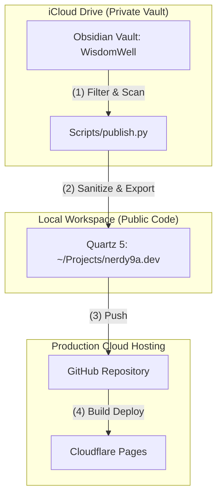

# How this Digital Garden is Built

This digital garden (**[nerdy9a.dev](https://nerdy9a.dev)**) is designed to publish public notes from a private Obsidian vault without leaking personal data or breaking link integrity.

## 📓 What is Obsidian?

If you aren't familiar with [Obsidian](https://obsidian.md/), it is a powerful, local-first note-taking app that acts as a "second brain." Notes are stored in standard Markdown (`.md`) files on your device, giving you complete ownership of your data. By using `wikilinks` to connect ideas, you build a web of interconnected knowledge that grows over time.

Because Obsidian stores everything in plain text, it is also highly compatible with AI models and agents. To see how to supercharge your setup, watch my YouTube guide on how to turn Obsidian into a personal AI assistant:
🎥 **[เปลี่ยนโน้ตให้เป็นเลขาอัจฉริยะด้วย Obsidian และ Claude AI (Obsidian AI 101)](https://www.youtube.com/@nerdy.mr.a)** on my channel **[Nerdy with Mr.A](https://www.youtube.com/@nerdy.mr.a)**.

---

## 🏗️ Architecture Blueprint

Instead of manual setup, you can easily build this website publishing pipeline using an AI coding assistant (like Claude, Gemini, or ChatGPT). Here is the architectural blueprint, the logic behind the technology choices, and how to prompt an AI to set it up for you.

The system splits note authoring from web hosting to keep your private notes safe and your local git repository clean of iCloud sync overhead:

---

## 🧠 Why Quartz & Cloudflare?

### Why Quartz?

- **Obsidian-Native**: It natively understands Obsidian-flavored markdown, including `wikilinks`, tags, callouts, and frontmatter.
- **Fast and Local-First**: Built on top of Vite and TypeScript, compiling into flat, static HTML/JS files.
- **Highly Extensible**: Written in TypeScript/React, allowing you to easily customize page layouts, styling, and component behaviors if needed.

### Why Cloudflare Pages?

- **Speed & Global CDN**: Lightning-fast load times globally with zero configuration.
- **Zero Cost**: Excellent free tier with unlimited bandwidth and builds.
- **Git-Integrated CI/CD**: Automatically rebuilds and deploys the site within seconds whenever you push changes to GitHub.

---

## 🔐 The Privacy & Link Integrity Challenge

A raw Obsidian vault is highly interconnected. If you publish notes directly:

1. **Privacy leaks**: Private folders (journals, finance, projects) might accidentally get published.
2. **Broken Links (404s)**: If you exclude private files, any public note containing a `wikilink` to a private file will result in a broken link on the website.

To solve this, we use a custom local python script (`publish.py`) that acts as a gatekeeper. It copies over only the public files and **rewrites** any links to private files back to plain text (e.g., `Finance` is rewritten into plain text `Finance`).

---

## 🤖 Setting Up with AI

You do not need to write the publishing script or configure the build system manually. Because this architecture is standard, you can use an AI coding assistant (like Claude, Gemini, or ChatGPT) to build it for you:

1. **Building the Gatekeeper Script**:
   Prompt the AI to write a Python script that runs locally inside your Obsidian vault. Describe the folders to exclude, the conditions for a note to be public (e.g., `publish: true` in the frontmatter), and have the AI implement the link sanitization logic (rewriting private `wikilinks` to plain text) and optimized image copying.
2. **Setting Up Quartz & Deployment**:
   Refer to the official [Quartz Documentation](https://quartz.jzhao.xyz/) for setup instructions. You can feed this URL or its contents to an AI assistant and ask it to guide you step-by-step through initializing the repository, connecting it to GitHub, and setting up the automatic deploy runner in Cloudflare Pages.
