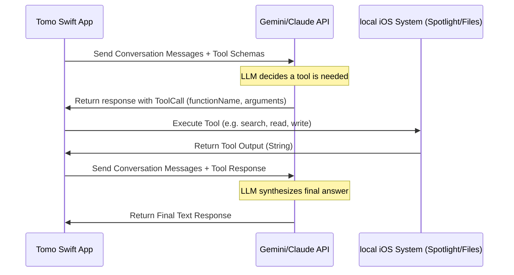

# Tomo: Talk to Your Obsidian (Unified AI Interface & Tool Calling Design)

This document outlines the architecture for integrating the Google Gemini API (and optionally Anthropic Claude) in Tomo v1 (targeting iOS 26). It defines a unified Swift protocol interface for model execution and tool calling (function calling), enabling an easy upgrade path to Apple's native iOS 27 `LanguageModel` protocol.

---

## 🏗️ The Unified Interface (Swift Protocols)

On iOS 26, we cannot use Apple's native `LanguageModel` protocol from the `foundation-models-utilities` package for third-party models since it requires iOS 27. Instead, we define our own lightweight, protocol-oriented interface in Swift that mimics Apple's design.

### 1. The Core Protocol

```swift
/// A unified representation of a Chat Message.
struct TomoChatMessage: Codable {
    enum Role: String, Codable {
        case system
        case user
        case model
        case tool
    }
    
    let role: Role
    let content: String
    let toolCalls: [TomoToolCall]?
    let toolResponse: TomoToolResponse?
}

/// Represents a request from the LLM to execute a tool.
struct TomoToolCall: Codable {
    let id: String
    let name: String
    let arguments: String // JSON string
}

/// Represents the execution result of a tool sent back to the LLM.
struct TomoToolResponse: Codable {
    let id: String
    let name: String
    let content: String
}

/// A unified protocol for language models in Tomo.
protocol TomoLanguageModel {
    var name: String { get }
    
    func generateCompletion(
        messages: [TomoChatMessage],
        tools: [TomoTool]
    ) async throws -> TomoChatMessage
}
```

---

## 🛠️ Tool Definition & Schema

LLMs expect tool definitions to follow a specific JSON Schema format so they understand the tool's parameters.

### 1. The Tool Protocol

We define a Swift protocol for Tomo tools:

```swift
protocol TomoTool {
    var name: String { get }
    var description: String { get }
    var parametersSchema: [String: Any] { get } // JSON Schema representing arguments
    
    func execute(arguments: [String: Any]) async throws -> String
}
```

### 2. Example Tool: `SearchVaultTool`

Here is how a local tool is implemented under this protocol:

```swift
struct SearchVaultTool: TomoTool {
    let name = "searchVault"
    let description = "Search the Obsidian vault using keywords or semantic query."
    
    var parametersSchema: [String: Any] {
        return [
            "type": "object",
            "properties": [
                "query": [
                    "type": "string",
                    "description": "The search term or keyword to query."
                ]
            ],
            "required": ["query"]
        ]
    }
    
    func execute(arguments: [String: Any]) async throws -> String {
        guard let query = arguments["query"] as? String else {
            throw TomoToolError.invalidArguments
        }
        
        // Executes local CSSearchQuery on CoreSpotlight
        let notes = try await CoreSpotlightSearcher.shared.search(query: query)
        return notes.map { "\($0.title) (\($0.relativePath))\n\($0.snippet)" }.joined(separator: "\n---\n")
    }
}
```

---

## 🔄 Tool Calling Flow (API Implementation)

Both Google Gemini and Anthropic Claude support tool calling natively via REST. The loop operates as follows:



### 1. Gemini Tool Payload vs Claude Tool Payload

Although the JSON formats differ slightly, our LLM implementations translate our unified `TomoTool` definition into their respective payloads:

#### Google Gemini API Payload
```json
{
  "contents": [...],
  "tools": [{
    "functionDeclarations": [{
      "name": "searchVault",
      "description": "Search the Obsidian vault using keywords...",
      "parameters": {
        "type": "OBJECT",
        "properties": {
          "query": {"type": "STRING", "description": "The search term..."}
        },
        "required": ["query"]
      }
    }]
  }]
}
```

#### Anthropic Claude API Payload
```json
{
  "model": "claude-3-5-sonnet-20241022",
  "messages": [...],
  "tools": [{
    "name": "searchVault",
    "description": "Search the Obsidian vault using keywords...",
    "input_schema": {
      "type": "object",
      "properties": {
        "query": {"type": "string", "description": "The search term..."}
      },
      "required": ["query"]
    }
  }]
}
```

---

## 📚 SDKs & Libraries for iOS 26

Rather than building HTTP clients from scratch, we can leverage official or lightweight open-source Swift packages:

### 1. Google Generative AI SDK (Official)
* **Package**: [github.com/google/generative-ai-swift](https://github.com/google/generative-ai-swift)
* **OS Target**: iOS 15.0+
* **Tool Calling Support**: Native via `FunctionDeclaration` and `GenerateContentResponse.functionCalls`.
* **Keychain integration**: We retrieve the API key from the iOS Keychain at runtime and initialize the `GenerativeModel`:
  ```swift
  import GoogleGenerativeAI
  
  let apiKey = try KeychainHelper.shared.read(service: "GeminiAPI")
  let searchVaultDecl = FunctionDeclaration(
      name: "searchVault",
      description: "Search the Obsidian vault...",
      parameters: [...]
  )
  
  let model = GenerativeModel(
      name: "gemini-1.5-flash",
      apiKey: apiKey,
      tools: [Tool(functionDeclarations: [searchVaultDecl])]
  )
  ```

### 2. Anthropic Claude API SDKs
Anthropic does not offer an official Swift SDK, but several community packages work on iOS 15+:
* **SwiftAnthropic**: [github.com/jamesruston/SwiftAnthropic](https://github.com/jamesruston/SwiftAnthropic)
* **Custom URLSession Wrapper**: Because Anthropic's REST API is extremely simple, building a custom wrapper for `URLSession` is highly reliable, lightweight, and requires no external dependency maintenance.

---

## 📈 Transition Path to iOS 27

By using our protocol-oriented abstraction (`TomoLanguageModel` and `TomoTool`), updating the codebase for iOS 27 in Tomo v2 is a straightforward conform-and-swap task:

1. **Replace Custom Protocols**: Make our `TomoTool` conform to or map directly to Apple's native `Tool` protocol.
2. **Adopt `ChatCompletionsLanguageModel`**: Swap our direct API client with Apple's `ChatCompletionsLanguageModel` or use `SystemLanguageModel.default` (on-device Neural Engine).
3. **Expose App Intents**: Map the tools directly to iOS 27 `AppIntent` structs, allowing Siri AI to dynamically orchestrate them using Apple's system-level model.
